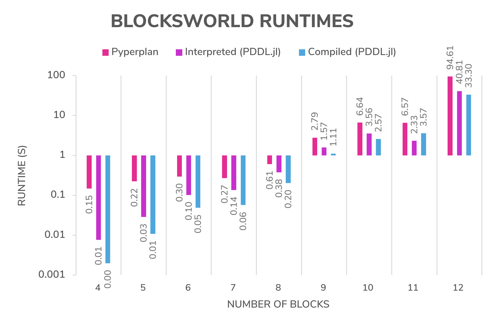

# SymbolicPlanners.jl

Symbolic planners for problems and domains specified in [PDDL](https://github.com/JuliaPlanners/PDDL.jl).

## Installation

Make sure [PDDL.jl](https://github.com/JuliaPlanners/PDDL.jl) is installed. Then run
```
add https://github.com/JuliaPlanners/SymbolicPlanners.jl
```
at the Julia package manager.

## Features

- Forward state-space planning (A*, BFS, etc.)
- Backward (i.e. regression) planning
- Policy-based planning (RTDP, MCTS, etc.)
- Relaxed-distance heuristics (Manhattan, _h_<sub>add</sub>, _h_<sub>max</sub>, etc.)
- Policy and plan simulation
- Modular framework for goal, reward and cost specifications
- Support for PDDL domains with numeric fluents and custom datatypes

## Planners

- [Forward breadth-first search](src/planners/bfs.jl)
- [Forward best-first search (A*, Greedy, etc.)](src/planners/forward.jl)
- [Backward best-first search (A*, Greedy, etc.)](src/planners/backward.jl)
- [Real Time Dynamic Programming (RTDP)](src/planners/rtdp.jl)
- [Monte Carlo Tree Search (MCTS)](src/planners/mcts.jl)
- [FastDownward and Pyperplan wrappers](src/planners/external.jl)

## Heuristics

- [Goal Count](src/heuristics/basic.jl): counts the number of unsatisfied goals
- [Manhattan](src/heuristics/basic.jl): L<sub>1</sub> distance for arbitrary numeric fluents
- [HSP heuristics](src/heuristics/hsp.jl): _h_<sub>add</sub>, _h_<sub>max</sub>, etc.
- [HSPr heuristics](src/heuristics/hsp.jl): the above, but for backward search
- [FF heuristic](src/heuristics/ff.jl): length of a relaxed plan, used by the Fast-Forward planner

## Specifications

- [MinStepsGoal](src/specifications/min_steps.jl): Minimize steps to reach a (symbolically-defined) goal
- [MinMetricGoal](src/specifications/min_metric.jl): Minimize a metric formula when reaching a goal
- [MaxMetricGoal](src/specifications/min_metric.jl): Maximize a metric formula when reaching a goal
- [StateConstrainedGoal](src/specifications/state_constrained.jl): Adds state constraints that must hold throughout a plan
- [GoalReward](src/specifications/goal_reward.jl): Achieve reward upon reaching a goal state
- [BonusGoalReward](src/specifications/goal_reward.jl): Adds goal reward to an existing specification
- [MultiGoalReward](src/specifications/goal_reward.jl): Achieve separate rewards for achieving separate goals
- [DiscountedReward](src/specifications/discounted.jl): Discounts the rewards or costs of an existing specification

## Performance

After Julia's JIT compilation, using SymbolicPlanners.jl on top of [PDDL.jl](https://github.com/JuliaPlanners/PDDL.jl) should be about 2 to 3x faster than [Pyperplan](https://github.com/aibasel/pyperplan) on the same machine when using reasonable search algorithms and heuristics.

Below is a comparison of runtimes between SymbolicPlanners.jl + PDDL.jl vs. Pyperplan when solving Blocksworld problems using A* search and the _h_<sub>add</sub> heuristic (note that the y-axis is logarithmically scaled):


